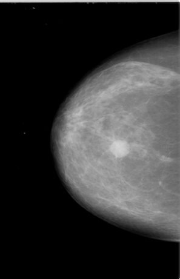

### Context and Motivation

In 2018 an estimated 266,120 U.S. women will develop invasive breast cancer, about 40,000 who will die from it. Breast cancer is the second most diagnosed form of cancer, and has the second highest death rate of any cancer in American women. Currently radiology imaging is the most effective way of diagnosis.  But it requires trained radiologists, who in 2009 were cited as only 87% accurate in their predictions. Demand for imaging services has nearly doubled over last 10 years, as mammograms are more widely prescribed. Early and accurate diagnoses play a large role in the survival rates of breast cancer. Patients with stage I breast cancer, have a 5-year relative survival rate of about 99%, compared to stage IV breast cancers, which have a 5-year relative survival rate of about 15%.

Computer vision techniques can now reduce human error because of improved computational power (GPUs), improved algorithms and greater ability to process vast data for identifying feature sets (deep learning). Our aim for this project is to create a solution that can serve as a backstop for doctors, and reduce the number of misdiagnoses.

### Scope

Our goal is to save lives with more accurate diagnoses for breast cancer. We decided to create a binary classifier based on computer vision techniques, that provided a prediction as to whether an image contained cancer or not and indicated the location of the tumor. 

### Dataset

Images from the Curated Breast Imaging Subset of Digital Database for Screening Mammography (CBIS-DDSM). They include 3,103 mammogram image examples with two different views:

* Cranial-Cuadal (CC): Exposure taken from above
* Mediolateral-oblique (MLO): Exposure from the side at an angle

The data contain 3,672 tissue abnormality examples which are split between calcifications and masses:
* 1,872 identified calcifications
* 1,696 identified masses

Each abnormality includes a cropped image of the abnormality and a mask indicating the location in the full mammogram image

#### Abnormality categories and labels

Each of the abnormalities is rated in several categories:

**Calcifications:**
* Type: Amorphous, Pleomorphic, Punctate, Dystrophic, Vascular, etc.
* Distribution: Clustered, Linear, Regional, Diffusely Scattered, etc.
* Assessment: 0 - 5 (Integer)
* Pathology: Benign, Benign With Callback, Malignant
* Subtlety: 1 - 5 (Integer)

**Masses:**
* Shape: Oval, Irregular, Round, Lymph Node, Focal Asymmetric Density, etc.
* Margin: Spiculated, Ill Defined, Circumscribed, Obscured, Microlobulated, etc.
* Assessment: 0 - 5 (Integer)
* Pathology: Benign, Benign With Callback, Malignant
* Subtlety: 1 - 5 (Integer)

### Data Processing

Our dataset came from the [Cancer Image Archive](https://www.cancerimagearchive.net), which was about 165 GB of data. There are ~2700 mammogram images, with mask images, for a total of 6700 images. The masks are overlaid, black and white images to help researchers identify where cancer occurs in the image. 

*Example of a mammogram image and its corresponding mask file.*

All of the images were in the DICOM format, a common medical imaging format, so they required conversion to png files. Besides making the images easier to load, the conversion also decreased the size of dataset by 9x without losing image resolution. We then applied CLAHE equalization to each mammogram image to bring out the localized contrast. 

These images were then segmented into 224x224 pixel images. This significantly increased the number of samples for training. Anything with a near black background was then filtered out so we would only train our model on actual tissue. The corresponding mask segments allowed us to label each segment as to  resulting in millions of smaller images. There was large proportion of the images not containing cancer, and we decided to only keep a random sample with a 1:5 ratio of positive to negative images.

The total dataset is 300,000+ 224x224 images. Finally we sorted them into training, validation, and test datasets with an 8:1:1 ratio. Due to the size of the dataset, the data was loaded in memory incrementally during training, using the built-in “flow from directory” functionality of Keras and Tensorflow.

### Cloud Computing

With our dataset ready, we pushed it to IBM SoftLayer’s S3 object storage. We explored different cloud compute environments based on the credits that we had from remaining classes. We found that some platforms were more helpful than others:

* Pre-configured Deep Learning/GPU Images on Google Cloud Compute and AWS were much more convenient than configuring an instance from scratch on IBM Softlayer.
* Google “Colaboratory” was especially helpful, letting you share a jupyter-like notebook, but with the shared document functionality of google docs as well as a GPU computer. It also included free GPU access to speed up training.

We followed the conventional approach to computer vision classification tasks and used Convolutional Neural Networks (CNNs) for this project. We started by trying to train our own architectures, but after further research and experimentation decided to use pretrained networks provided by the Keras deep learning package in python. The network that we settled on was MobileNet, a relatively small architecture intended for use on mobile devices, because of its speed of training/iteration and low memory usage. In addition to the pretrained base convolutional layers of Mobilenet, we added additional dense layers that we could train specifically to our task of identifying breast cancer.

We tried many approaches, but the final model that we settled on was 4 layers of 1024 nodes each. Our best results came after training our dense layers alone for 5 epochs, acclimating them to the pre-trained features of Mobilenet. Then we opened up all layers for training for an additional 100 epochs through the data.

We also dynamically made adjustments to our class weights after each epoch in order to keep our model conservative. By weighting positive classes higher, we could train the model to make more positive predictions, leading to our desired “more false positives than false negatives”.

We trained our model on a NVIDIA Tesla P100 on Centos7 on IBM’s SoftLayer after downloading all proper NVIDIA drivers, building a docker image with NVIDIA deep learning libraries (NVIDIA-CUDA), and then loading our dataset downloaded from IBM S3. For future work, we would like to find a package that would do automated parameter searching. We wrote our own wrapper function from scratch to allow us to see the training graphs of each model to best tune our results.

### Results

After training on our final architecture we achieved 79% accuracy on our validation set. It should be noted that our validation set was unbalanced 1:5, positive:negative. After reweighting the results, our model still achieved 75.36% accuracy on our binary classification problem. The confusion matrix can be seen below in Table 1.

#### Table 1.

|                      | True Positive | True Negative |
|----------------------|---------------|---------------|
| Predicted   Positive | 681           | 293           |
| Predicted   Negative | 904           | 3842          |
 
#### Table 2.

| Confusion Matrix Analysis          |       |   
|------------------------------------|-------|
| Sensitivity                        | 0.43  |
| Specificity                        | 0.929 |
| Precision                          | 0.699 |
| Negative   Predictive Value        | 0.81  |
| False   Positive Rate              | 0.071 |
| False   Discovery Rate             | 0.301 |
| False   Negative Rate              | 0.57  |
| Accuracy                           | 0.791 |
| F1   Score                         | 0.532 |
| Matthews   Correlation Coefficient | 0.427 |

### Evaluation

The model is significantly better than chance at 0.791 but has an error rate too high for deployment in a clinical trial.  The lack of accuracy is mostly false positives, which is acceptable for our purposes because this is meant as a secondary sanity check for doctors. This project still requires significant development time before replacing a trained radiologist. 

The recall for our model was higher than our precision, which in our case was what we wanted. In other words, our model tended to reduce false negatives over false positives. Our reasoning was that the costs of missing cancer was greater than having doctors double check their diagnosis a few extra times.

### Challenges

* The amount of data was significant and required GPUs to train in a reasonable amount of time.
* Segmenting the image files was time consuming and limited experiments with different segment sizes.
* Grayscale images decreased the efficacy of pretrained ImageNet models
* Soft edges of tumors in the images challenged the efficacy of pretrained models

### Web App

With a trained model, we built a web app.  The web app allows users to upload an mammogram image.  When the image is uploaded, it is segmented and inference is performed on each segment with the trained model.  Segments that are predicted to contain potential tumors are highlighted in the resulting image.

To try out the result of the training, click the [here](http://158.85.202.22/) to upload an image and run the detection algorithm.

Note: The image processing is very slow and can take up to ten minutes to perform.

Here are some mammogram files that can be used to test the web app (save the images):
[Example 1](img/mammogram1.png)
[Example 2](img/mammogram2.png)
[Example 3](img/mammogram3.png)
[Example 4](img/mammogram4.png)
[Example 5](img/mammogram5.png)
[Example 6](img/mammogram6.png)
[Example 7](img/mammogram7.png)
[Example 8](img/mammogram8.png)

